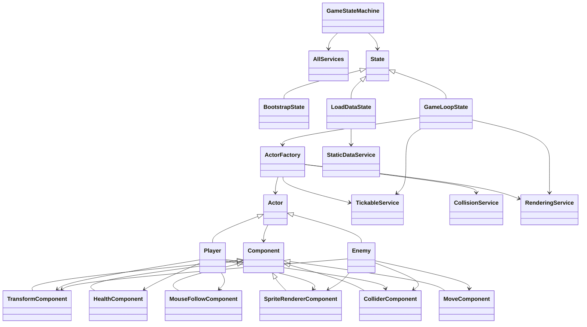

# Python Project

This is project is made for university assignment, it's a simple game engine on pygame with a very small avoiding built-in game.
The idea of the engine is to have game state machine that controls states of the application, actor/component system like in unreal engine and simple rendering.


# Class Structure



# Main Ideas:
- AllServices - Static container for services. Is used for easier access/creation of the services. Very usefull for unit testing
- GameStateMachine - Controls switching between states, so that the developer can clearly see and edit the flow of the project
- Actor - Base game object (similar to UE) with components. Actors could have their own logic
- Component - Logic classes that are attached to the actors. Are used for creating composition within actors

# Main Algorithms
- Dictionary of class type to instance in AllServices
- Dictionary within Game State Machine
- Callbacks/Events/Delegates within Actor/Component
- Collision Detection in Collision Service
- Object creation/initialization in Actor Factory

## How To Start And Use The Program

Install dependencies:

```bash
pip install -r requirements.txt
```

Start the game from the project root:

```bash
python main.py
```

